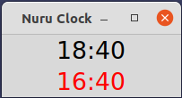

# nclock

nclock is a clock application to show Japan time and Indonesia time for checking my girlfriend time. 

### Usage
**install**
```bash
pip install git+https://github.com/TakutoYoshikai/nclock.git
```
**start application**
```bash
nclock
```

### LICENSE
MIT LICENSE
